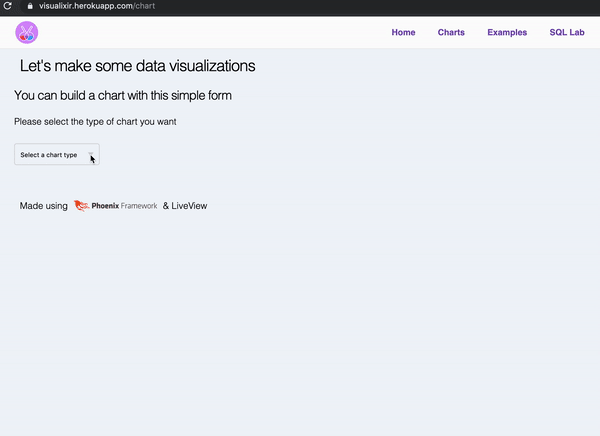
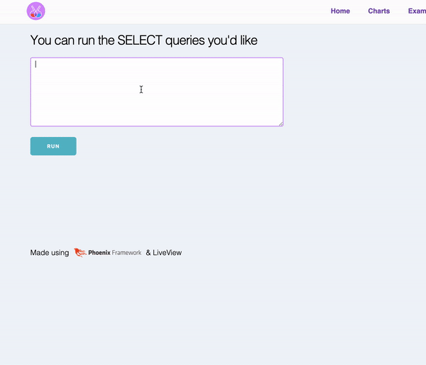

# Visualixir

This is my entry in [Phoenix Phrenzy](https://phoenixphrenzy.com), showing off what [Phoenix](https://phoenixframework.org/) and [LiveView](https://github.com/phoenixframework/phoenix_live_view) can do.

1. Make charts selecting specific fields of your DB.

2. Make SQL queries and download the results.

## About

Visualixir is a visualization tool made with Phoenix LiveView. Currently this
project is at a very early stage and offers very little options on charts.

The purpose of the project is to have a more direct process between the data on
the backend queried directly form a DB and how it is visualized. Under the hood,
it queries the data, process it and directly generate the charts using SVG.

It has been great working with LiveView. There were many "it feels like cheating" moments, followed by others banging head to the wall ones, but the latest were only a few. Although this is not that interactive I hope it does exemplify how a common scenario can be handled with LiveView.
